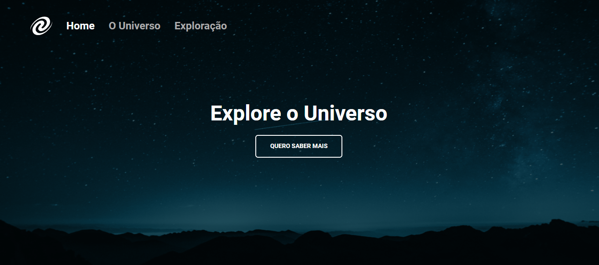

<h1 align="center">🪐 Universo SPA! 🪐</h1>

Criação de um site no formato Single Page Application. Esse projeto foi desenvolvido no programa <a href="https://www.rocketseat.com.br/explorer">Explorer</a> da RocketSeat.

  <a href="#🚀-tecnologias">Tecnologias</a>&nbsp;&nbsp;&nbsp;|&nbsp;&nbsp;&nbsp;
  <a href="#💻-projeto">Projeto</a>

 

  

## 🚀 Tecnologias

Esse projeto foi desenvolvido com as seguintes tecnologias:

- Estrutura de dados HTML
- Conceito Sigle Pages Application
- Rotas
- Class
- Fetch
- Import e Export

## 💻 Projeto

O site Universe SPA é um projeto que tem como objetivo ensinar os fundamentos essenciais do JavaScript com foco em conceitos de SPA, Rotas e class para a criação da navegação entre os conteúdos das páginas. Além disso, concentramos nossos esforços em garantir que o código seja desenvolvido de maneira semanticamente correta e claro.

- [Acesse o projeto finalizado, online](https://jp-xaxa.github.io/universe-SPA/)
